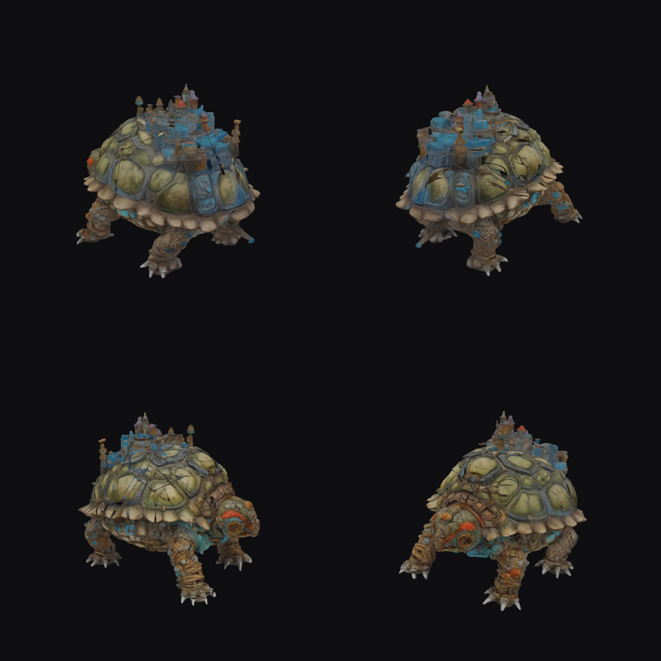
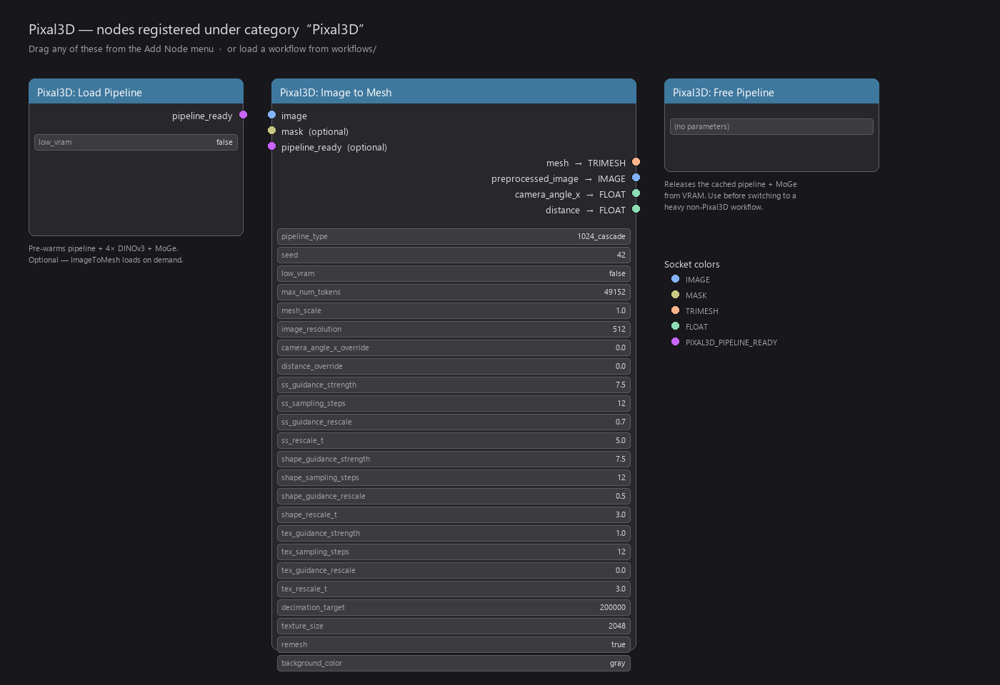

# ComfyUI-Pixal3D

<p align="left">
  <a href="https://github.com/TencentARC/Pixal3D"></a>
  <a href="https://github.com/comfyanonymous/ComfyUI"></a>
  
  
  
  
  
</p>

<p align="left">
  <a href="LICENSE"></a>
  <a href="NOTICE.md"></a>
</p>

ComfyUI custom node for **[Pixal3D](https://github.com/TencentARC/Pixal3D)** — Tencent's SIGGRAPH 2026 single-image to PBR-textured-3D pipeline — on **Windows** with **RTX 30/40/50** GPUs. Built on top of [ComfyUI-Trellis2](https://github.com/visualbruno/ComfyUI-Trellis2).

**One image → textured PBR mesh in ~3-5 min on an RTX 5090.**

<p align="center">
  
  <br><sub><em>Four base-color views of the generated PBR mesh.</em></sub>
</p>

<p align="center">
  
  <br><sub><em>Same mesh, untextured clay shading — to read the geometry quality.</em></sub>
</p>

---

## ⚠️ License you inherit

Pixal3D is licensed by Tencent for **academic / non-commercial use only**, and **explicitly NOT for use within the European Union**. By installing this plugin you agree to those terms. See [NOTICE.md](NOTICE.md).

---

## Will it work on my machine?

**Short version:** if you have ComfyUI Desktop running TRELLIS2 successfully on an RTX 30/40/50 GPU, this will work too.

| | Requirement |
|---|---|
| OS | Windows 10 / 11 (x64) — bundled natten wheel is Windows-only |
| GPU | NVIDIA RTX 30 / 40 / 50 with ≥ **16 GB VRAM** (24 GB+ recommended; the bundled workflows ship with `1024_cascade` + 16/16/16 steps, see the Note node in each for low-VRAM tweaks) |
| Disk | ~50 GB free (24 GB Pixal3D + 4 GB other models + workspace) |
| CPU | Any modern x86_64 — **Intel and AMD both work**, no special requirements |
| Python | **3.12 only** (your worker venv must be 3.12 — the bundled wheel is cp312) |
| PyTorch | **2.8.x + CUDA 12.8** (your worker venv must match — wheel is built against torch 2.8.0+cu128) |
| ComfyUI | Desktop (or portable) with **[ComfyUI-Trellis2](https://github.com/visualbruno/ComfyUI-Trellis2) already installed and launched once** |

### Will the wheel work for me?

The bundled `wheels/natten-0.21.0+winsm89ptx-...-win_amd64.whl` is locked to **Windows + Python 3.12 + PyTorch 2.8 + CUDA 12.8 + NVIDIA GPU**. If your setup matches all of the above (which the standard ComfyUI-Trellis2 pixi env does), the wheel just works.

If any one of those doesn't match (you're on Linux / Python 3.11 / PyTorch 2.7 / etc.), you need to **install natten yourself for your env first**, then run `install.py` — it will auto-detect your natten and skip the bundled wheel. Two options:

- **Linux**: `pip install natten==0.21.0 -f https://whl.natten.org` (official prebuilt wheels for many cu/torch combos), then run `install.py`.
- **Windows with a non-default Python/PyTorch/GPU**: build from source per [docs/BUILD_NATTEN.md](docs/BUILD_NATTEN.md), then run `install.py`. The installer probes `natten.HAS_LIBNATTEN` + a real `na2d` call on cuda — if your wheel works, it's kept and the bundled one is skipped.

**AMD / Intel GPUs are not supported** — upstream Pixal3D requires CUDA.

---

## Prerequisites — TRELLIS2 must be working first

This plugin **does not** install its own CUDA stack. It rides on top of ComfyUI-Trellis2's pixi-managed worker environment (which already contains o_voxel, cumesh, flex_gemm, nvdiffrast, flash_attn, etc.).

**Before installing this plugin:**

1. Install **[ComfyUI-Trellis2](https://github.com/visualbruno/ComfyUI-Trellis2)** via ComfyUI Manager (or git clone into `custom_nodes/`).
2. **Launch ComfyUI Desktop once** — TRELLIS2's first launch bootstraps its pixi env at `C:\ce\_env_<hash>\.pixi\envs\default\`. You'll see "Starting server" in the log when it's ready.
3. **Verify TRELLIS2 works** — load one of its example workflows and queue it. If TRELLIS2 itself errors, fix that first; Pixal3D won't help you.

If you skip these, the Pixal3D installer can't find the worker Python and will exit with a clear error message.

---

## Install

```powershell
# 1. Open the custom_nodes folder
cd $HOME\Documents\ComfyUI\custom_nodes

# 2. Clone this repo *next to* ComfyUI-Trellis2 (NOT inside it)
git clone https://github.com/dreamrec/ComfyUI-Pixal3D.git

# 3. Run the installer
cd ComfyUI-Pixal3D
python install.py

# 4. Restart ComfyUI Desktop
```

What `install.py` does, in ~30 seconds:

- Auto-detects the TRELLIS2 worker Python.
- Clones [TencentARC/Pixal3D](https://github.com/TencentARC/Pixal3D) at a pinned commit into `_pixal3d_src/`.
- Installs MoGe + utils3d + pyrender + PyOpenGL into the worker venv.
- Installs the bundled natten wheel from `wheels/`.
- Patches Pixal3D's BiRefNet for the Windows `inference_mode` interaction.
- Sanity-checks all imports.

**On first queue**, ComfyUI will download ~26 GB of model weights from HuggingFace (one-time, cached): Pixal3D weights (24 GB) + DINOv3 (1.2 GB) + MoGe-2 (1.3 GB) + BiRefNet (0.44 GB). Cold-start with download takes ~30 min on a fast connection; subsequent runs use the cache.

---

## Use

After install + restart, three nodes appear in the Add Node menu under **`Pixal3D`**:

<p align="center">
  
</p>

The only one you need is **`Pixal3D: Image to Mesh`**. Drop in an image, queue, get a GLB.

### Two workflows are bundled in `workflows/`

| File | Use when |
|---|---|
| `pixal3d_image_to_mesh.json` | Default. Internal BiRefNet does background removal automatically. |
| `pixal3d_image_to_mesh_with_external_rembg.json` | You want a better matte than BiRefNet (RMBG-2.0, SAM, manual). Connects a mask into the node, which skips internal background removal. |

Load either via **Workflow → Browse**. Drop your image into the LoadImage node, hit Queue.

GLBs are auto-saved to `ComfyUI/output/pixal3d_<timestamp>_<seed>.glb` with PNG-textures (open in Blender / Three.js / any standard viewer).

**Full parameter reference** for all three nodes lives in [docs/NODES.md](docs/NODES.md).

---

## Troubleshooting

| Error | Fix |
|---|---|
| `Could not find ComfyUI-Trellis2` during install | ComfyUI-Trellis2 isn't installed next to this repo, or it hasn't been launched once to bootstrap its pixi env. Install/launch TRELLIS2 first. |
| `Inference tensors do not track version counter` mid-run | You're on an older version of this plugin. `git pull` and re-run `python install.py`. (Fixed by wrapping `run_pixal3d` in `torch.inference_mode(False)`.) |
| Thin black lines on the textured mesh | Set the `background_color` widget on the node to `gray` (the default). If you're on an old saved workflow it may still have `black` — re-create the node from the menu. |
| `No module named 'pyrender'` or PyOpenGL ctypes error | Worker venv missing render deps. Re-run `python install.py`. |
| `OSError: We couldn't connect to 'https://hf-mirror.com'` | Your environment has `HF_ENDPOINT` set to the Chinese mirror. The plugin overrides this internally; if you still hit it, restart ComfyUI after install. |
| `OutOfMemoryError` / `Allocation on device` | Drop `max_num_tokens` to 32768 or 24576, optionally enable `low_vram` on the node. |
| Blender refuses to open the GLB (`STB cannot decode image data`) | You have an old GLB from before this fix. Re-run; new GLBs use PNG textures. |
| Workflow JSON rejected with widget-index errors | You saved the workflow from an old plugin version. Delete the `Pixal3DImageToMesh` node and add a fresh one from the menu. |

---

## Memory + performance

| Setting | VRAM peak | Time | Quality |
|---|---|---|---|
| `1024_cascade` + steps 16/16/16 + 65k tokens + 300k decim + 4096 tex (bundled workflow defaults, v0.1.3+) | ~14 GB | ~3 min warm / ~7-10 min cold | High-fidelity safe |
| `1024_cascade` + steps 12/12/12 + 49k tokens + 200k decim + 2048 tex | ~12 GB | ~3-5 min | Recommended |
| `1024_cascade` + steps 4/4/4 + 32k tokens | ~7 GB | ~1.5 min | Preview |
| `1536_cascade` + steps 16/16/16 + 4096 tex | ~46 GB | crashes on ≤34 GB cards | **Currently OOMs** (see below) |
| `low_vram=true` + 24k tokens | ~8 GB | ~6-8 min | Tight cards |

Bullets on a few non-obvious VRAM facts we've measured:

- **`keep_warm` widget (v0.1.4+):** the Pixal3D pipeline is ~14 GB resident once loaded; `keep_warm=True` (default) leaves it in VRAM so the next call is ~3 min, `keep_warm=False` auto-frees it at the end of the run (next call pays the ~7-10 min cold-load again).
- **Cold-load tax:** the first run after a ComfyUI restart on this user's setup spends 1-3 min loading Pixal3D weights into RAM and another 30-60 s transferring to GPU. Subsequent runs hit the cached singleton.
- **The "1536 OOM" ceiling:** `1536_cascade` registers ~30 GB of model weights and ComfyUI Desktop's bundled `model_management.py` reserves an additional 16 GB cudaMallocAsync cast buffer via `comfy-aimdo 0.4.0` — total 46 GB, which overshoots the 5090's 34 GB and silently crashes the worker mid-`pipeline.to(device)`. The bundled workflows stay on `1024_cascade` until upstream lands a fix (see below).

### Upstream roadmap (TRELLIS2 `pixal3d` branch — not yet merged to main)

[`visualbruno/ComfyUI-Trellis2#pixal3d`](https://github.com/visualbruno/ComfyUI-Trellis2/tree/pixal3d) is actively iterating on a fix for the 1536 OOM:

- **`use_tiled_decoder` widget** — tiles the high-res DinoV3 inference so peak VRAM drops below the 34 GB ceiling. This unlocks `1536_cascade` on 24 GB cards.
- **`pipeline_type` expanded** to `["512", "1024", "1024_cascade", "1536_cascade"]` — adds lighter modes for 12-16 GB cards.
- **Per-stage memory load/unload** — interleaved offload between sampler stages, slimming peak VRAM further.
- **Standard `natten-0.21.6` wheel** bundled — our custom 60 MB `natten-0.21.0+winsm89ptx` becomes redundant.

When that branch merges to TRELLIS2 main, this plugin will adopt the new knobs in a follow-up release.

---

## Credits + license

Wrapper code (this repo): **MIT**, dreamrec 2026.

The actual research / model work belongs to:

- **[Pixal3D](https://github.com/TencentARC/Pixal3D)** — Tencent ARC + Tsinghua, SIGGRAPH 2026. **Tencent license — academic only, no EU use.**
- **[TRELLIS.2](https://github.com/microsoft/TRELLIS.2)** + **[ComfyUI-Trellis2](https://github.com/visualbruno/ComfyUI-Trellis2)** — Microsoft Research + visualbruno (MIT).
- **[NATTEN](https://github.com/SHI-Labs/NATTEN)** — SHI-Labs (MIT).
- **[NAF](https://github.com/valeoai/NAF)** — valeoai (Apache 2.0).
- **[MoGe](https://github.com/microsoft/MoGe)** — Microsoft Research (MIT).
- **[BiRefNet](https://github.com/ZhengPeng7/BiRefNet)** — ZhengPeng7 (MIT).

Full third-party license breakdown in [NOTICE.md](NOTICE.md).
